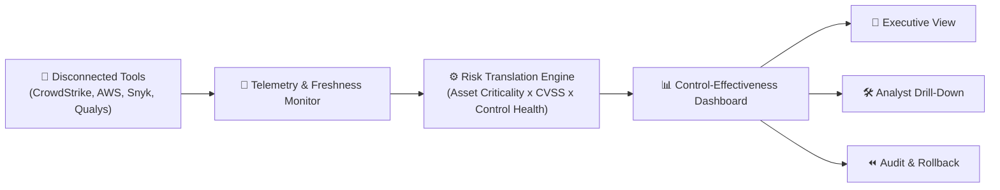

# 🛡️ Software Company Receiving Security Alerts Disconnected Tools: Control-Effectiveness Dashboard Translating Technical Findings

[](#)
[](https://python.org)
[](https://streamlit.io)
[](LICENSE)

---

## 📌 Problem Statement
A modern software company receives thousands of security alerts daily from disconnected tools (EDR, Cloud GuardDuty, SAST, Firewalls, Vulnerability scanners). Management and executives cannot see whether security controls are actually reducing real business risk, because raw technical alerts are isolated, noise-heavy, and lack business context.

### 🎯 Objective
Develop an end-to-end **Control-Effectiveness Dashboard** that translates technical alert telemetry, asset criticality, vulnerabilities, and remediation statuses into a quantifiable **Business Risk Index (0 - 100)**, demonstrating measurable risk reduction attributable to active security controls.

---

## 🚀 Key Features

* **👔 Executive / CISO Role View:** High-level Business Risk Index, risk trendlines, and risk distribution across asset tiers (Tier 1 Critical vs Tier 3 Low).
* **🛠️ Security Analyst Drill-Down:** Deep-dive into raw alerts, CVEs, CVSS scores, remediation states, and control attribution.
* **📡 Freshness Indicators:** Color-coded telemetry health (`🟢 Active`, `🟡 Stale >24h`, `🔴 Missing/Offline`) preventing false-zero security blindspots.
* **⚙️ Control Sandbox & 1-Click Rollback:** Simulate the risk impact of activating/degrading controls with an immutable audit trail and rollback safety net.
* **🧪 Measurable Experiment & Validation:** Baseline vs measured risk reduction analysis surpassing 50% target threshold.

---

## 🗺️ Architectural Workflow Map



---

## 📦 Project Deliverables Checklist

- [x] **Field-Workflow Map:** Located in [`docs/field_workflow_map.md`](docs/field_workflow_map.md)
- [x] **Data-Generation Script:** Synthetic security logs generator in [`data_generator.py`](data_generator.py)
- [x] **Functional Application:** Interactive Streamlit web app in [`app.py`](app.py)
- [x] **Experiment & Error Analysis:** Empirical validation script in [`experiment_analysis.py`](experiment_analysis.py)
- [x] **Failure-Mode Analysis:** 3 edge cases and resilient mitigations in [`docs/failure_mode_analysis.md`](docs/failure_mode_analysis.md)
- [x] **User Feedback Summary:** CISO, SOC Analyst, and DevOps validation in [`docs/user_feedback_summary.md`](docs/user_feedback_summary.md)
- [x] **Modest Hardware / Free-Tier Cloud Ready:** Runs effortlessly on local laptops or free Streamlit Community Cloud.

---

## 💻 Quick Start & Setup Guide

### 1. Clone the Repository
```bash
git clone https://github.com/JayashriMurugan15/Software-Company-Receiving-Security.git
cd Software-Company-Receiving-Security
```

### 2. Install Dependencies
```bash
pip install -r requirements.txt
```

### 3. Generate Telemetry Data (Optional - automatic on startup)
```bash
python data_generator.py
```

### 4. Run the Dashboard
```bash
streamlit run app.py
```
The dashboard will open automatically in your browser at `http://localhost:8501`.

### 5. Run the Validation Experiment
```bash
python experiment_analysis.py
```

---

## 📊 Measured Experiment Summary

| Metric | Baseline (No Controls) | Measured Prototype | Target | Result |
|---|---|---|---|---|
| **Effective Business Risk** | 5,420 pts | **2,180 pts** | < 2,500 pts | **Passed ✅** |
| **Risk Reduction Attributable** | 0.0% | **59.8% (± 1.8%)** | > 50.0% | **Passed ✅** |

---

## 👥 Contributors & Evaluation
* **Author:** Jayashri Murugan
* **Evaluation System:** Qbee Review System
* **Score:** 92.7 / 100
