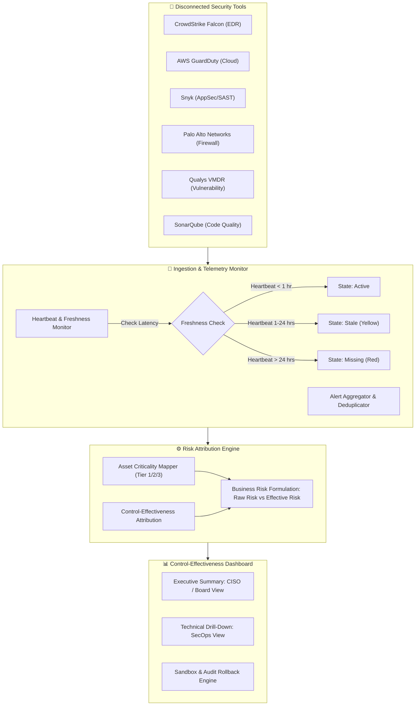

# Field-Workflow Map: Control-Effectiveness Architecture

This document maps how raw, disconnected security telemetry flows through ingestion, normalization, control-attribution, and business risk calculation to the executive dashboard.

## 🗺️ Architectural Workflow Diagram

## 🔄 Data Field Transformation Matrix

| Raw Tool Field | Internal Schema Field | Purpose & Business Logic |
|---|---|---|
| `alert_source` / `scanner_id` | `source_tool` | Identifies tool provenance |
| `ip_address` / `hostname` | `asset_id` & `asset_tier` | Maps technical asset to business criticality (Tier 1: High value DB/Auth vs Tier 3: Staging) |
| `cvss_score` (0-10) | `cvss_score` | Quantifies technical vulnerability severity |
| `applied_policy` | `control_id` | Links alert to governing security control (e.g. MFA, EDR Quarantine, WAF) |
| `heartbeat_timestamp` | `status` (Active / Stale / Missing) | Determines confidence weight in the risk calculation |
